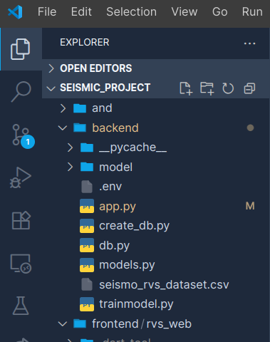
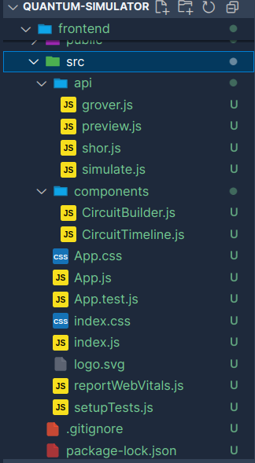

# Workspace Theme Suite -

A complete Visual Studio Code theme family with:

-  **Workspace Dark**
-  **Workspace Light**
-  **Workspace High Contrast**
-  **Custom File & Folder Icons**

##  Installation

**Option 1: From VS Code Marketplace (once published)**  
Search for **"Workspace Theme Suite"** and click "Install".

##  Theme Screenshots

| Workspace Dark | Workspace Light | High Contrast |
|----------------|-----------------|----------------|
|  |  |  |

---

##  Icon Previews

| Icon Set 1 | Icon Set 2 |
|------------|-------------|
|  |  |

